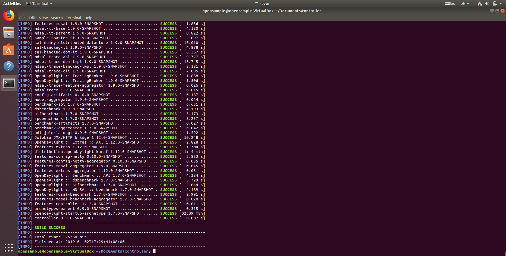
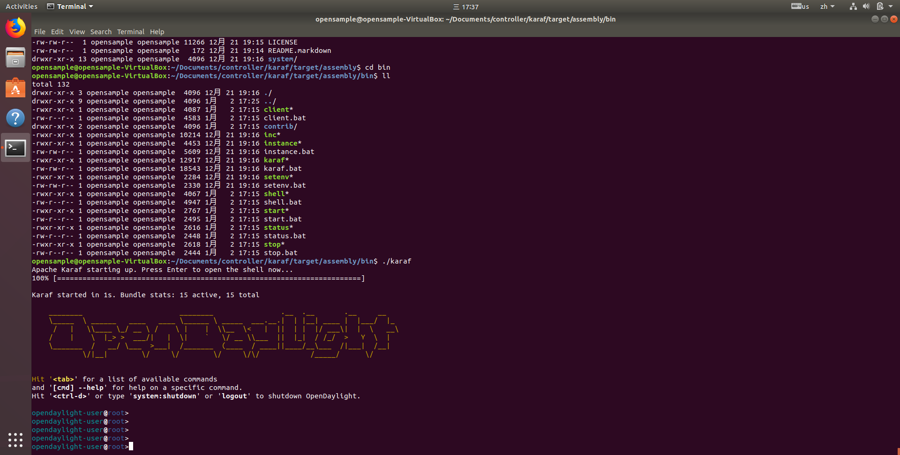

# ubuntu 学习

Ubuntu 版本：18.04 最小化安装

1. 安装 npm：`sudo apt install npm`
2. 安装 cnpm：`npm install cnpm -g –registry=https://registry.npm.taobao.org`
3. 查看当前路径：`pwd`
4. 找到settings->system settings->updata下面的Use secure Connetion去掉,冒是因为使用了https协议下载导致的问题

## 快捷键

- `Ctr+Alt+T` 打开终端

## 1 安装 搜狗输入法 for Linux
1. 浏览器下载搜狗输入法 for Linux：`sogoupinyin_2.2.0.0108_amd64.deb`，下载完后双击安装。
2. 系统 `Settings` -> `Region & Language` -> `Manage Installed Languages`，第一次操作系统会自动下载安装一些包。
3. 将 `Keyboard input methid system` 由 `IBus` 改为 `fcitx` 后重启。
4. 重启完后系统输入法单击右键 `Configure` -> `+` -> 去掉 `Only Show Current Language` -> 搜索 `Sogou Pinyin` 并添加。
5. 快捷键 `Ctr+Space` 切换输入法即可调出搜狗输入法。

## 2 安装 JDK1.8
1. 新建 jvm 文件夹（文件夹的名字不能乱改）：`sudo mkdir /usr/lib/jvm`
2. 复制 jdk1.8 到 jvm 文件夹：`sudo cp jdk-8u191-linux-x64.tar.gz /usr/lib/jvm`
3. 进入 jvm 文件夹：`cd /usr/lib/jvm`
4. 解压 `sudo tar -zxvf jdk-8u191-linux-x64.tar.gz`
5. 配置 jdk 环境变量，解压完后执行：`sudo gedit /etc/profile`
    - 在打开的文档最后添加下面内容：
    - `export JAVA_HOME=/usr/lib/jvm/jdk1.8.0_191`
    - `export PATH=$PATH:$JAVA_HOME/bin:$JAVA_HOME/jre/bin`
6. 更新 profile 文件使配置生效：`source /etc/profile`
7. 测试：`java -version`

        java version "1.8.0_191"
        Java(TM) SE Runtime Environment (build 1.8.0_191-b12)
        Java HotSpot(TM) 64-Bit Server VM (build 25.191-b12, mixed mode)

## 2 安装 MAVEN
1. 新建 maven 文件夹（文件夹的名字不能乱改）：`sudo mkdir /usr/local/maven3`
2. 复制 jdk1.8 到 jvm 文件夹：`sudo cp apache-maven-3.6.0-bin.tar.gz mkdir /usr/local/maven3`
3. 进入 jvm 文件夹：`cd /usr/local/maven3`
4. 解压 `sudo tar -zxvf apache-maven-3.6.0-bin.tar.gz`
5. 配置 jdk 环境变量，解压完后执行：`sudo gedit /etc/profile`
    - 在打开的文档最后添加下面内容：
    - export JAVA_HOME=/usr/lib/jvm/jdk1.8.0_191
    - `export MAVEN_HOME=/usr/local/maven3/apache-maven-3.6.0`
    - export PATH=$PATH:$JAVA_HOME/bin:$JAVA_HOME/jre/bin`:$MAVEN_HOME/bin`
6. 更新 profile 文件使配置生效：`source /etc/profile`
7. 测试：`mvn -version`

        Apache Maven 3.6.0 (97c98ec64a1fdfee7767ce5ffb20918da4f719f3; 2018-10-25T02:41:47+08:00)
        Maven home: /usr/local/maven3/apache-maven-3.6.0
        Java version: 1.8.0_191, vendor: Oracle Corporation, runtime: /usr/lib/jvm/jdk1.8.0_191/jre
        Default locale: en_US, platform encoding: UTF-8
        OS name: "linux", version: "4.15.0-29-generic", arch: "amd64", family: "unix"

## 3 安装 Git
1. `sudo apt-get install git-core`
2. `git --verison`

        git version 2.17.1

## 4 配置 Opendaylight 的 settings.xml

1. 针对Opendaylight，安装好Maven后，需要编辑一个非常重要的文件 settings.xml。直接修改该文件，就能在机器上全局地定制 Maven的行为。~/.m2是默认的maven本地仓库。刚装好maven的后~/.m2下是没有settings.xml的文件的。在/etc/maven下有settings.xml的原型，一般情况下，我们更偏向于复制该文件至home目录下的.m2/目录下（这里~表示用户目录），然后修改该文件，在用户范围定制 Maven的行为。前者又被叫做全局配置，后者被称为用户配置。如果两者都存在，它们的内容将被合并，并且用户范围的settings.xml优先。在这里要在~/目录下创建.m2文件夹，然后执行修改命令（详见官网：[https://wiki.opendaylight.org/view/GettingStarted:Development_Environment_Setup](https://wiki.opendaylight.org/view/GettingStarted:Development_Environment_Setup)）
2. 
    - `cp -n ~/.m2/settings.xml{,.orig} ; \`
    - `wget -q -O - https://raw.githubusercontent.com/opendaylight/odlparent/master/settings.xml > ~/.m2/settings.xml`
3. 完成后输入 `sudo gedit /.m2/settings.xml` 查看 `settings.xml` 内容，应该显示如下：

        <?xml version="1.0" encoding="UTF-8"?>
        <!-- vi: set et smarttab sw=2 tabstop=2: -->
        <!--
        Copyright (c) 2014, 2015 Cisco Systems, Inc. and others.  All rights reserved.

        This program and the accompanying materials are made available under the
        terms of the Eclipse Public License v1.0 which accompanies this distribution,
        and is available at http://www.eclipse.org/legal/epl-v10.html
        -->
        <settings xmlns="http://maven.apache.org/SETTINGS/1.0.0" xmlns:xsi="http://www.w3.org/2001/XMLSchema-instance" xsi:schemaLocation="http://maven.apache.org/SETTINGS/1.0.0 http://maven.apache.org/xsd/settings-1.0.0.xsd">

        <mirror>  
            <id>nexus-aliyun</id>  
            <mirrorOf>central</mirrorOf>    
            <name>Nexus aliyun</name>  
            <url>http://maven.aliyun.com/nexus/content/groups/public</url>  
        </mirror> 

        <profiles>
            <profile>
            <id>opendaylight-release</id>
            <repositories>
                <repository>
                <id>opendaylight-mirror</id>
                <name>opendaylight-mirror</name>
                <url>https://nexus.opendaylight.org/content/repositories/public/</url>
                <releases>
                    <enabled>true</enabled>
                    <updatePolicy>never</updatePolicy>
                </releases>
                <snapshots>
                    <enabled>false</enabled>
                </snapshots>
                </repository>
            </repositories>
            <pluginRepositories>
                <pluginRepository>
                <id>opendaylight-mirror</id>
                <name>opendaylight-mirror</name>
                <url>https://nexus.opendaylight.org/content/repositories/public/</url>
                <releases>
                    <enabled>true</enabled>
                    <updatePolicy>never</updatePolicy>
                </releases>
                <snapshots>
                    <enabled>false</enabled>
                </snapshots>
                </pluginRepository>
            </pluginRepositories>
            </profile>

            <profile>
            <id>opendaylight-snapshots</id>
            <repositories>
                <repository>
                <id>opendaylight-snapshot</id>
                <name>opendaylight-snapshot</name>
                <url>https://nexus.opendaylight.org/content/repositories/opendaylight.snapshot/</url>
                <releases>
                    <enabled>false</enabled>
                </releases>
                <snapshots>
                    <enabled>true</enabled>
                </snapshots>
                </repository>
            </repositories>
            <pluginRepositories>
                <pluginRepository>
                <id>opendaylight-snapshot</id>
                <name>opendaylight-snapshot</name>
                <url>https://nexus.opendaylight.org/content/repositories/opendaylight.snapshot/</url>
                <releases>
                    <enabled>false</enabled>
                </releases>
                <snapshots>
                    <enabled>true</enabled>
                </snapshots>
                </pluginRepository>
            </pluginRepositories>
            </profile>
        </profiles>

        <activeProfiles>
            <activeProfile>opendaylight-release</activeProfile>
            <activeProfile>opendaylight-snapshots</activeProfile>
        </activeProfiles>
        </settings>

## 5 编译 Controller 子项目的源码
1. git 拉取源码 `git clone https://github.com/opendaylight/controller.git`
2. 进入目录 controller `cd controller`
3. 运行以下命令 `mvn clean install`
4. 由于默认下载的包在国外，第一次编译时速度较慢，可以跳过测试以加快速度，运行以下命令：`mvn clean install -DskipTests`
5. 项目编译成功后出现将如下结果：
    - 
    - 
            [INFO] ------------------------------------------------------------------------
            [INFO] Reactor Summary:
            [INFO] 
            [INFO] mdsal-artifacts 1.9.0-SNAPSHOT ..................... SUCCESS [  0.977 s]
            [INFO] mdsal-parent 1.9.0-SNAPSHOT ........................ SUCCESS [  7.547 s]
            [INFO] sal-common-api 1.9.0-SNAPSHOT ...................... SUCCESS [ 21.442 s]
            [INFO] sal-common-util 1.9.0-SNAPSHOT ..................... SUCCESS [ 10.774 s]
            [INFO] sal-common-impl 1.9.0-SNAPSHOT ..................... SUCCESS [ 16.072 s]
            [INFO] sal-test-model 1.9.0-SNAPSHOT ...................... SUCCESS [ 38.143 s]
            [INFO] sal-core-api 1.9.0-SNAPSHOT ........................ SUCCESS [ 10.900 s]
            [INFO] sal-core-spi 1.9.0-SNAPSHOT ........................ SUCCESS [ 13.645 s]
            [INFO] sal-binding-api 1.9.0-SNAPSHOT ..................... SUCCESS [ 14.455 s]
            [INFO] sal-core-compat 1.9.0-SNAPSHOT ..................... SUCCESS [ 13.754 s]
            [INFO] sal-inmemory-datastore 1.9.0-SNAPSHOT .............. SUCCESS [ 10.430 s]
            [INFO] sal-broker-impl 1.9.0-SNAPSHOT ..................... SUCCESS [ 17.977 s]
            [INFO] sal-binding-util 1.9.0-SNAPSHOT .................... SUCCESS [  9.420 s]
            [INFO] sal-binding-broker-impl 1.9.0-SNAPSHOT ............. SUCCESS [ 23.918 s]
            [INFO] sample-toaster 1.9.0-SNAPSHOT ...................... SUCCESS [ 11.403 s]
            [INFO] sample-toaster-consumer 1.9.0-SNAPSHOT ............. SUCCESS [  7.776 s]
            [INFO] sample-toaster-provider 1.9.0-SNAPSHOT ............. SUCCESS [ 11.655 s]
            [INFO] sal-parent 1.9.0-SNAPSHOT .......................... SUCCESS [  0.019 s]
            [INFO] sal-samples 1.9.0-SNAPSHOT ......................... SUCCESS [  0.025 s]
            [INFO] clustering-it 1.9.0-SNAPSHOT ....................... SUCCESS [  0.023 s]
            [INFO] clustering-it-config 1.9.0-SNAPSHOT ................ SUCCESS [  3.156 s]
            [INFO] clustering-it-model 1.9.0-SNAPSHOT ................. SUCCESS [ 26.501 s]
            [INFO] sal-clustering-commons 1.9.0-SNAPSHOT .............. SUCCESS [ 25.469 s]
            [INFO] sal-akka-raft 1.9.0-SNAPSHOT ....................... SUCCESS [ 30.307 s]
            [INFO] cds-access-api 1.5.0-SNAPSHOT ...................... SUCCESS [ 18.133 s]
            [INFO] cds-access-client 1.5.0-SNAPSHOT ................... SUCCESS [ 17.950 s]
            [INFO] cds-dom-api 1.5.0-SNAPSHOT ......................... SUCCESS [  7.453 s]
            [INFO] sal-akka-raft-example 1.9.0-SNAPSHOT ............... SUCCESS [ 15.009 s]
            [INFO] sal-distributed-datastore 1.9.0-SNAPSHOT ........... SUCCESS [ 56.708 s]
            [INFO] clustering-it-provider 1.9.0-SNAPSHOT .............. SUCCESS [ 16.422 s]
            [INFO] config-subsystem 0.10.0-SNAPSHOT ................... SUCCESS [  0.257 s]
            [INFO] netty-config-api 0.10.0-SNAPSHOT ................... SUCCESS [  2.003 s]
            [INFO] netty-event-executor-config 0.10.0-SNAPSHOT ........ SUCCESS [  2.391 s]
            [INFO] netty-threadgroup-config 0.10.0-SNAPSHOT ........... SUCCESS [  2.543 s]
            [INFO] netty-timer-config 0.10.0-SNAPSHOT ................. SUCCESS [  2.339 s]
            [INFO] threadpool-config-api 0.10.0-SNAPSHOT .............. SUCCESS [  2.408 s]
            [INFO] threadpool-config-impl 0.10.0-SNAPSHOT ............. SUCCESS [  2.706 s]
            [INFO] OpenDaylight :: Config-Netty 0.10.0-SNAPSHOT ....... SUCCESS [  9.663 s]
            [INFO] OpenDaylight :: MDSAL :: Common 1.9.0-SNAPSHOT ..... SUCCESS [  2.767 s]
            [INFO] sal-connector-api 1.9.0-SNAPSHOT ................... SUCCESS [  7.917 s]
            [INFO] blueprint 0.10.0-SNAPSHOT .......................... SUCCESS [ 16.901 s]
            [INFO] OpenDaylight :: MDSAL :: Broker 1.9.0-SNAPSHOT ..... SUCCESS [  5.578 s]
            [INFO] odl-mdsal-clustering-commons 1.9.0-SNAPSHOT ........ SUCCESS [  2.723 s]
            [INFO] sal-remoterpc-connector 1.9.0-SNAPSHOT ............. SUCCESS [ 18.946 s]
            [INFO] odl-mdsal-remoterpc-connector 1.9.0-SNAPSHOT ....... SUCCESS [  4.558 s]
            [INFO] sal-cluster-admin-api 1.9.0-SNAPSHOT ............... SUCCESS [ 17.972 s]
            [INFO] sal-cluster-admin-impl 1.9.0-SNAPSHOT .............. SUCCESS [ 17.539 s]
            [INFO] odl-mdsal-distributed-datastore 1.9.0-SNAPSHOT ..... SUCCESS [  3.892 s]
            [INFO] sal-clustering-config 1.9.0-SNAPSHOT ............... SUCCESS [  1.520 s]
            [INFO] odl-mdsal-broker 1.9.0-SNAPSHOT .................... SUCCESS [  2.318 s]
            [INFO] odl-clustering-test-app 1.9.0-SNAPSHOT ............. SUCCESS [  2.322 s]
            [INFO] model-inventory 1.9.0-SNAPSHOT ..................... SUCCESS [  4.989 s]
            [INFO] OpenDaylight :: MD-SAL :: Inventory Model 1.9.0-SNAPSHOT SUCCESS [  3.093 s]
            [INFO] OpenDaylight :: Toaster 1.9.0-SNAPSHOT ............. SUCCESS [  2.247 s]
            [INFO] odl-mdsal-all 1.9.0-SNAPSHOT ....................... SUCCESS [  2.373 s]
            [INFO] odl-mdsal-clustering 1.9.0-SNAPSHOT ................ SUCCESS [  2.705 s]
            [INFO] model-topology 1.9.0-SNAPSHOT ...................... SUCCESS [  4.899 s]
            [INFO] OpenDaylight :: MD-SAL :: Topology Model 1.9.0-SNAPSHOT SUCCESS [  2.917 s]
            [INFO] messagebus-api 1.9.0-SNAPSHOT ...................... SUCCESS [ 13.690 s]
            [INFO] messagebus-spi 1.9.0-SNAPSHOT ...................... SUCCESS [  8.473 s]
            [INFO] messagebus-util 1.9.0-SNAPSHOT ..................... SUCCESS [  8.749 s]
            [INFO] messagebus-impl 1.9.0-SNAPSHOT ..................... SUCCESS [ 10.646 s]
            [INFO] odl-message-bus-collector 1.9.0-SNAPSHOT ........... SUCCESS [  3.979 s]
            [INFO] features-mdsal 1.9.0-SNAPSHOT ...................... SUCCESS [  2.351 s]
            [INFO] mdsal-it-base 1.9.0-SNAPSHOT ....................... SUCCESS [  3.487 s]
            [INFO] mdsal-it-parent 1.9.0-SNAPSHOT ..................... SUCCESS [  0.836 s]
            [INFO] sample-toaster-it 1.9.0-SNAPSHOT ................... SUCCESS [  1.941 s]
            [INFO] sal-dummy-distributed-datastore 1.9.0-SNAPSHOT ..... SUCCESS [ 15.207 s]
            [INFO] sal-binding-it 1.9.0-SNAPSHOT ...................... SUCCESS [  4.731 s]
            [INFO] sal-binding-dom-it 1.9.0-SNAPSHOT .................. SUCCESS [  6.697 s]
            [INFO] mdsal-trace-api 1.9.0-SNAPSHOT ..................... SUCCESS [ 10.129 s]
            [INFO] mdsal-trace-dom-impl 1.9.0-SNAPSHOT ................ SUCCESS [ 20.138 s]
            [INFO] mdsal-trace-binding-impl 1.9.0-SNAPSHOT ............ SUCCESS [  8.429 s]
            [INFO] mdsal-trace-cli 1.9.0-SNAPSHOT ..................... SUCCESS [  7.058 s]
            [INFO] OpenDaylight :: TracingBroker 1.9.0-SNAPSHOT ....... SUCCESS [  3.308 s]
            [INFO] OpenDaylight :: TracingBroker 1.9.0-SNAPSHOT ....... SUCCESS [  2.279 s]
            [INFO] mdsal-trace-feature-aggregator 1.9.0-SNAPSHOT ...... SUCCESS [  0.026 s]
            [INFO] mdsaltrace 1.9.0-SNAPSHOT .......................... SUCCESS [  0.039 s]
            [INFO] config-artifacts 0.10.0-SNAPSHOT ................... SUCCESS [  0.136 s]
            [INFO] model-aggregator 1.9.0-SNAPSHOT .................... SUCCESS [  0.044 s]
            [INFO] benchmark-api 1.7.0-SNAPSHOT ....................... SUCCESS [  6.380 s]
            [INFO] dsbenchmark 1.7.0-SNAPSHOT ......................... SUCCESS [  7.581 s]
            [INFO] ntfbenchmark 1.7.0-SNAPSHOT ........................ SUCCESS [  5.278 s]
            [INFO] rpcbenchmark 1.7.0-SNAPSHOT ........................ SUCCESS [  3.323 s]
            [INFO] benchmark-artifacts 1.7.0-SNAPSHOT ................. SUCCESS [  0.012 s]
            [INFO] benchmark-aggregator 1.7.0-SNAPSHOT ................ SUCCESS [  0.027 s]
            [INFO] odl-jolokia-osgi 0.9.0-SNAPSHOT .................... SUCCESS [ 14.128 s]
            [INFO] Jolokia JMX/HTTP bridge 1.12.0-SNAPSHOT ............ SUCCESS [  7.514 s]
            [INFO] OpenDaylight :: Extras :: All 1.12.0-SNAPSHOT ...... SUCCESS [  2.041 s]
            [INFO] features-extras 1.12.0-SNAPSHOT .................... SUCCESS [  1.882 s]
            [INFO] distribution.opendaylight-karaf 1.12.0-SNAPSHOT .... SUCCESS [ 30.550 s]
            [INFO] features-config-netty 0.10.0-SNAPSHOT .............. SUCCESS [  6.744 s]
            [INFO] features-config-netty-aggregator 0.10.0-SNAPSHOT ... SUCCESS [  0.034 s]
            [INFO] features-mdsal-aggregator 1.9.0-SNAPSHOT ........... SUCCESS [  0.035 s]
            [INFO] features-extras-aggregator 1.12.0-SNAPSHOT ......... SUCCESS [  0.034 s]
            [INFO] OpenDaylight :: Benchmark :: API 1.7.0-SNAPSHOT .... SUCCESS [  1.902 s]
            [INFO] OpenDaylight :: dsbenchmark 1.7.0-SNAPSHOT ......... SUCCESS [  2.050 s]
            [INFO] OpenDaylight :: ntfbenchmark 1.7.0-SNAPSHOT ........ SUCCESS [  1.805 s]
            [INFO] OpenDaylight :: MD-SAL :: benchmark 1.7.0-SNAPSHOT . SUCCESS [  1.870 s]
            [INFO] features-mdsal-benchmark 1.7.0-SNAPSHOT ............ SUCCESS [  1.834 s]
            [INFO] features-mdsal-benchmark-aggregator 1.7.0-SNAPSHOT . SUCCESS [  0.011 s]
            [INFO] features-controller 1.12.0-SNAPSHOT ................ SUCCESS [  0.031 s]
            [INFO] archetypes-parent 0.9.0-SNAPSHOT ................... SUCCESS [  0.318 s]
            [INFO] opendaylight-startup-archetype 1.7.0-SNAPSHOT ...... SUCCESS [  5.405 s]
            [INFO] controller 0.9.0-SNAPSHOT .......................... SUCCESS [  0.026 s]
            [INFO] ------------------------------------------------------------------------
            [INFO] BUILD SUCCESS
            [INFO] ------------------------------------------------------------------------
            [INFO] Total time:  14:13 min
            [INFO] Finished at: 2019-01-03T08:46:40+08:00
            [INFO] ------------------------------------------------------------------------

## 6 运行启动 Controller 项目

1. 进入 Controller 项目下 karaf 发布的子目录：`cd karaf/target/assembly/bin`
2. 运行以下命令以启动 Controller 项目：`./karaf`
    - 